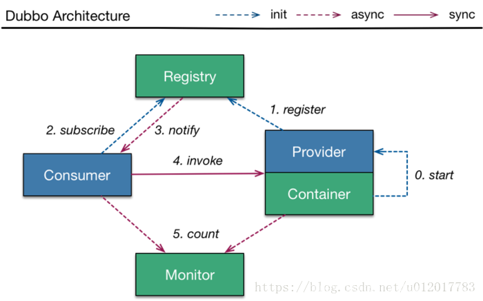

## 第二节 Dubbo 概念及特性

&emsp;&emsp;Dubbo 是一款高性能、轻量级的开源 Java RPC 框架，它提供了三大核心能力：**面向接口的远程方法调用，智能容错和负载均衡，服务自动注册和发现。**

&emsp;&emsp;分布式系统是将一个系统拆分为多个不同的服务。


### 2.1 Dubbo 特性


&emsp;&emsp;**灰度发布**（又名金丝雀发布）是指在黑与白之间，能够平滑过渡的一种发布方式。在其上可以进行A/B testing，即让一部分用户继续用产品特性A，一部分用户开始用产品特性B，如果用户对B没有什么反对意见，那么逐步扩大范围，把所有用户都迁移到B上面来。灰度发布可以保证整体系统的稳定，在初始灰度的时候就可以发现、调整问题，以保证其影响度。


####（1）服务注册中心

&emsp;&emsp;相比 Hessian 类 RPC 框架，Dubbo 有自己的服务中心，写好的服务可以注册到服务中心，客户端从服务中心寻找服务，然后再到相应的服务提供者机器获取服务。通过服务中心可以实现**集群、负载均衡、高可用(容错)**等重要功能。

&emsp;&emsp;服务中心一般使用 zookeeper 实现，也有 redis 和其他一些方式。以使用 zookeeper 作为服务中心为例，服务提供者启动后会在 zookeeper 的 /dubbo 节点下创建提供的服务节点，包含服务提供者 ip、port 等信息。服务提供者关闭时会从 zookeeper 中移除对应的服务。

&emsp;&emsp;服务使用者会从注册中心 zookeeper 中寻找服务，同一个服务可能会有多个提供者，Dubbo 会帮助找到合适的服务提供者，也就是针对服务提供者的负载均衡。


####（2）负载均衡

&emsp;&emsp;当同一个服务有多个提供者在提供服务时，客户端如何正确的选择提供者实现负载均衡呢？dubbo 提供了几种方案：

* random 随机选提供者，并可以给提供者设置权重
* roundrobin 轮询选择提供者
* leastactive 最少活跃调用数，相同活跃数的随机，活跃数：指调用前后计数差。使慢的提供者收到更少请求，因为越慢的提供者的调用前后计数差会越大。
* consistenthash 一致性 hash，相同参数的请求发到同一台机器上。

####（3）简化测试，允许直连提供者

&emsp;&emsp;在开发阶段为了方便测试，通常系统客户端能指定调用某个服务提供者，那么可以在引用服务时加一个 url 参数去指定服务提供者。 配置如下：

```xml
<dubbo:reference id="xxxService"interface="com.alibaba.xxx.XxxService"url="dubbo://localhost:20890"/>
```


####（4）服务版本，服务分组

在 Dubbo 配置文件中可以通过制定版本实现连接制定提供者，也就是通过服务版本可以控制服务的不兼容升级；当同一个服务有多种实现时，可以使用服务分组进行区分。

### 2.2 Dubbo 设计架构




* **服务提供者（Provider）**：暴露服务的服务提供方，服务提供者在启动时，向注册中心**注册**自己提供的服务。
* **服务消费者（Consumer）**: 调用远程服务的服务消费方，服务消费者在启动时，向注册中心**订阅**自己所需的服务，服务消费者，从提供者地址列表中，基于软负载均衡算法，选一台提供者进行调用，如果调用失败，再选另一台调用。
* **注册中心（Registry）**：注册中心返回服务提供者地址列表给消费者，如果有变更，注册中心将基于**长连接推送**变更数据给消费者。
* **监控中心（Monitor）**：服务消费者和提供者，在内存中累计调用次数和调用时间，定时每分钟发送一次统计数据到监控中心。


