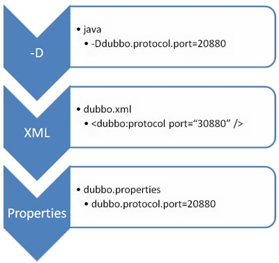

## 第五节 Dubbo 配置


### 5.1 dubbo.properties & 属性加载顺序

#### 5.1.1 属性配置

&emsp;&emsp;以属性配置的方式来配置 Dubbo 应用，如果应用足够简单，例如，不需要多注册中心或多协议，并且需要在 spring 容器中共享配置，那么，可以直接使用 dubbo.properties 作为默认配置。

&emsp;&emsp;Dubbo 可以**自动加载** classpath 根目录下的 dubbo.properties，但是同样可以使用 JVM 参数来指定路径：`-Ddubbo.properties.file=xxx.properties`。


#### 5.1.2 重写与优先级




优先级从高到低：

* JVM -D 参数：当部署或者启动应用时，它可以轻易地重写配置，比如，改变 dubbo 协议端口；

* XML：XML 中的当前配置会重写 dubbo.properties 中的；

* Properties：默认配置，仅仅作用于以上两者没有配置时。

> 如果在 classpath 下有超过一个 dubbo.properties 文件，比如，两个 jar 包都各自包含了 dubbo.properties，dubbo 将随机选择一个加载，并且打印错误日志。
> 如果 id 没有在 protocol 中配置，将使用 name 作为默认属性。


### 5.2 启动检查 

&emsp;&emsp;在启动时检查依赖的服务是否可用。Dubbo 缺省会在启动时检查依赖的服务是否可用，**不可用时会抛出异常，阻止 Spring 初始化完成**，以便上线时，能及早发现问题，默认 check="true"。

&emsp;&emsp;可以通过 check="false" 关闭检查，比如，测试时，有些服务不关心，或者出现了循环依赖，必须有一方先启动。

&emsp;&emsp;另外，如果项目的 Spring 容器是懒加载的，或者通过 API 编程延迟引用服务，请关闭 check，否则服务临时不可用时，会抛出异常，拿到 null 引用，如果 check="false"，总是会返回引用，当服务恢复时，能自动连上。

#### 用法

* 关闭**某个服务**的启动时检查 (没有提供者时报错)：
    
    ```xml
    <dubbo:reference interface="com.foo.BarService" check="false" />
    ```

* 关闭**所有服务**的启动时检查 (没有提供者时报错)：
    
    ```xml
    <dubbo:consumer check="false" />
    ```

* 关闭注册中心启动时检查 (注册订阅失败时报错)：

    ```xml
    <dubbo:registry check="false" />
    ```

* 通过 dubbo.properties

    ```properties
    dubbo.reference.com.foo.BarService.check=false
    dubbo.reference.check=false
    dubbo.consumer.check=false
    dubbo.registry.check=false
    ```
    
  * `dubbo.reference.check=false`，**强制改变**所有 reference 的 check 值，就算配置中有声明，也会被覆盖。

  * `dubbo.consumer.check=false`，是设置 check 的**缺省值**，如果配置中有显式的声明，如：`<dubbo:reference check="true"/>`，不会受影响。

  * `dubbo.registry.check=false`，前面两个都是指**订阅成功**，但提供者列表**是否为空**是否报错，**如果注册订阅失败时，也允许启动**，需使用此选项，将在后台定时重试。   
    

* 通过 -D 参数

    ```shell
    java -Ddubbo.reference.com.foo.BarService.check=false
    java -Ddubbo.reference.check=false
    java -Ddubbo.consumer.check=false 
    java -Ddubbo.registry.check=false
    ```

### 5.3 配置超时 & 配置覆盖关系

以 timeout 为例，下图显示了配置的查找顺序，其它 retries, loadbalance, actives 等类似：

* **方法级**优先，**接口级**次之，**全局配置**再次之。
* 如果级别一样，则**消费方**优先，提供方次之。

其中，服务提供方配置，通过 URL 经由注册中心传递给消费方。


（建议由服务提供方设置超时，因为一个方法需要执行多长时间，服务提供方更清楚，如果一个消费方同时引用多个服务，就不需要关心每个服务的超时设置）。


### 5.4 配置重试次数

关键字 retries，不包含第一次调用。

```xml
<dubbo:reference interface="com.gx.gmall.service.UserService" id="userServuce" timeout="5000" retries="3">
</dubbo:reference>
```

除了第一次调用，方法会再次重试三次！值为 0，代表不重试。

* 幂等（设置重试次数）
  * 如：查询、删除、修改
* 非幂等（不能设置重试次数）
  * 如：新增


### 5.5 配置多版本


### 5.6 配置本地存根


### 5.7 配置与 SpringBoot 整合的三种方式
