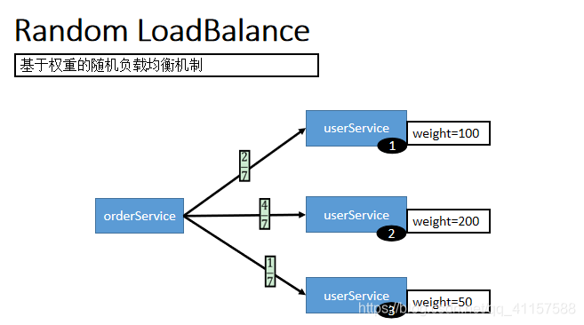
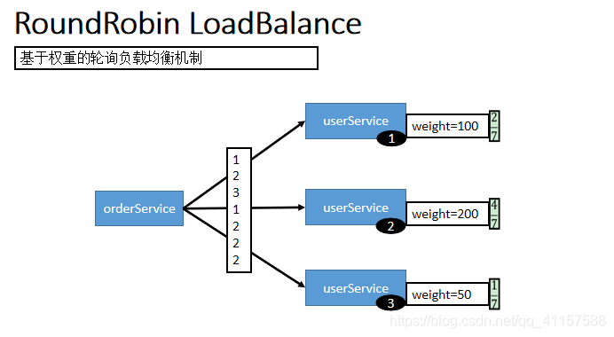
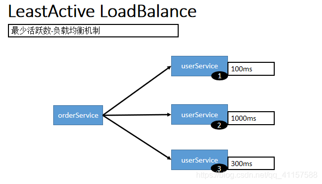

## 第六节 高可用

### 6.1 ZooKeeper 宕机与 Dubbo 直连

现象：zookeeper 注册中心宕机，还可以消费 dubbo 暴露的服务。


原因（健壮性）：

1. 监控中心宕掉不影响使用，只是丢失部分采样数据

2. 数据库宕掉后，注册中心仍能通过缓存提供服务列表查询，但不能注册新服务

3. 注册中心对等集群，任意一台宕掉后，将自动切换到另一台

4. **注册中心全部宕掉后，服务提供者和服务消费者仍能通过本地缓存通讯**

5. 服务提供者无状态，任意一台宕掉后，不影响使用

6. 服务提供者全部宕掉后，服务消费者应用将无法使用，并无限次重连等待服务提供者恢复

高可用：通过设计，减少系统不能提供服务的时间；

##### Dubbo 直连

```java
@Reference(url="127.0.0.1:20882")
UserService userService; 
```

### 6.2 集群下 dubbo 负载均衡配置

在集群负载均衡时，Dubbo 提供了多种均衡策略，缺省为 random 随机调用。

负载均衡策略如下:

#### 6.2.1 Random LoadBalance 基于权重的随机负载均衡机制

* 随机，按权重设置随机概率。

* 在一个截面上碰撞的概率高，但调用量越大分布越均匀，而且按概率使用权重后也比较均匀，有利于动态调整提供者权重。



#### 6.2.2 RoundRobin LoadBalance 基于权重的轮询负载均衡机制 


* 轮询，按公约后的权重设置轮询比率。、

* 存在慢的提供者累积请求的问题，比如：第二台机器很慢，但没挂，当请求调到第二台时就卡在那，久而久之，所有请求都卡在调到第二台上




#### 6.2.3 LeastActive LoadBalance 最少活跃数负载均衡机制 

* 最少活跃调用数，相同活跃数的随机，活跃数指调用前后计数差。

* 使慢的提供者收到更少请求，因为越慢的提供者的调用前后计数差会越大。




#### 6.2.4 ConsistentHash LoadBalance 一致性 hash 负载均衡机制


* 一致性 Hash，相同参数的请求总是发到同一提供者。

* 当某一台提供者挂时，原本发往该提供者的请求，基于虚拟节点，平摊到其它提供者，不会引起剧烈变动。

* 算法参见：http://en.wikipedia.org/wiki/Consistent_hashing

* 缺省只对第一个参数 Hash，如果要修改，请配置 `<dubbo:parameter key="hash.arguments" value="0,1" />`

* 缺省用 160 份虚拟节点，如果要修改，请配置 `<dubbo:parameter key="hash.nodes" value="320" />`


#### 6.2.5 配置

 
* 服务端服务级别

```xml
<dubbo:service interface="..." loadbalance="roundrobin" />
```

* 客户端服务级别

```xml
<dubbo:reference interface="..." loadbalance="roundrobin" />
```

* 服务端方法级别

```xml
<dubbo:service interface="...">
    <dubbo:method name="..." loadbalance="roundrobin"/>
</dubbo:service>
```

* 客户端方法级别

```xml
<dubbo:reference interface="...">
    <dubbo:method name="..." loadbalance="roundrobin"/>
</dubbo:reference>   
```

### 6.3 服务降级


### 6.4 服务容错 & Hystrix


### 6.5 