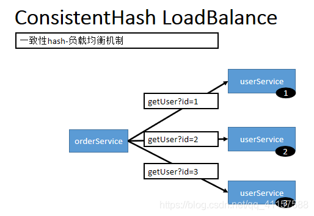

## 第六节 高可用

### 6.1 ZooKeeper 宕机与 Dubbo 直连

现象：zookeeper 注册中心宕机，还可以消费 dubbo 暴露的服务。


原因（健壮性）：

1. 监控中心宕掉不影响使用，只是丢失部分采样数据

2. 数据库宕掉后，注册中心仍能通过缓存提供服务列表查询，但不能注册新服务

3. 注册中心对等集群，任意一台宕掉后，将自动切换到另一台

4. **注册中心全部宕掉后，服务提供者和服务消费者仍能通过本地缓存通讯**

5. 服务提供者无状态，任意一台宕掉后，不影响使用

6. 服务提供者全部宕掉后，服务消费者应用将无法使用，并无限次重连等待服务提供者恢复

高可用：通过设计，减少系统不能提供服务的时间；

##### Dubbo 直连

```java
@Reference(url="127.0.0.1:20882")
UserService userService; 
```

### 6.2 集群下 dubbo 负载均衡配置

在集群负载均衡时，Dubbo 提供了多种均衡策略，缺省为 random 随机调用。

负载均衡策略如下: https://dubbo.apache.org/zh/docs/v2.7/dev/source/loadbalance/#m-zhdocsv27devsourceloadbalance

#### 6.2.1 Random LoadBalance 基于权重的随机负载均衡机制

该模式为默认模式

* 随机，按权重设置随机概率。

* 在一个截面上碰撞的概率高，但调用量越大分布越均匀，而且按概率使用权重后也比较均匀，有利于动态调整提供者权重。


#### 6.2.2 RoundRobin LoadBalance 基于权重的轮询负载均衡机制 


* 轮询，按公约后的权重设置轮询比率。、

* 存在慢的提供者累积请求的问题，比如：第二台机器很慢，但没挂，当请求调到第二台时就卡在那，久而久之，所有请求都卡在调到第二台上


#### 6.2.3 LeastActive LoadBalance 最少活跃数负载均衡机制 

* 最少活跃调用数，相同活跃数的随机，活跃数指调用前后计数差。

* 使慢的提供者收到更少请求，因为越慢的提供者的调用前后计数差会越大。


#### 6.2.4 ConsistentHash LoadBalance 一致性 hash 负载均衡机制




* 一致性 Hash，相同参数的请求总是发到同一提供者。

* 当某一台提供者挂时，原本发往该提供者的请求，基于虚拟节点，平摊到其它提供者，不会引起剧烈变动。

* 算法参见：http://en.wikipedia.org/wiki/Consistent_hashing

* 缺省只对第一个参数 Hash，如果要修改，请配置 `<dubbo:parameter key="hash.arguments" value="0,1" />`

* 缺省用 160 份虚拟节点，如果要修改，请配置 `<dubbo:parameter key="hash.nodes" value="320" />`


#### 6.2.5 配置

 
* 服务端服务级别

```xml
<dubbo:service interface="..." loadbalance="roundrobin" />
```

* 客户端服务级别

```xml
<dubbo:reference interface="..." loadbalance="roundrobin" />
```

* 服务端方法级别

```xml
<dubbo:service interface="...">
    <dubbo:method name="..." loadbalance="roundrobin"/>
</dubbo:service>
```

* 客户端方法级别

```xml
<dubbo:reference interface="...">
    <dubbo:method name="..." loadbalance="roundrobin"/>
</dubbo:reference>   
```

### 6.3 服务降级

&emsp;&emsp;当服务器压力剧增的情况下，根据实际业务情况及流量，对一些服务和页面有策略的不处理或换种简单的方式处理，从而释放服务器资源以保证核心交易正常运作或高效运作。

&emsp;&emsp;可以通过服务降级功能临时屏蔽某个出错的非关键服务，并定义降级后的返回策略。


向注册中心写入动态配置覆盖规则：

```java
RegistryFactory registryFactory = ExtensionLoader.getExtensionLoader(RegistryFactory.class).getAdaptiveExtension();
Registry registry = registryFactory.getRegistry(URL.valueOf("zookeeper://10.20.153.10:2181"));
registry.register(URL.valueOf("override://0.0.0.0/com.foo.BarService?category=configurators&dynamic=false&application=foo&mock=force:return+null"));
```

其中：

* `mock=force:return+null` 表示**消费方对该服务的方法调用都直接返回 null 值，不发起远程调用。**用来屏蔽不重要服务不可用时对调用方的影响。

* `mock=fail:return+null` **表示消费方对该服务的方法调用在失败后，再返回 null 值，不抛异常。**用来容忍不重要服务不稳定时对调用方的影响。

也可以在 dubbo-admin 界面操作。

### 6.4 服务容错 

&emsp;&emsp;在集群调用失败时，Dubbo 提供了多种容错方案，缺省为 failover 重试。

#### 6.4.1 集群容错模式

##### Failover Cluster

失败自动切换，当出现失败，重试其它服务器。通常用于读操作，但重试会带来更长延迟。可通过 retries=“2” 来设置重试次数(不含第一次)。

重试次数配置如下：

```xml
<dubbo:service retries=“2” />
```

或

```xml
<dubbo:reference retries=“2” />
```

或

```xml
dubbo:reference
<dubbo:method name=“findFoo” retries=“2” />
</dubbo:reference>
```

##### Failfast Cluster

快速失败，只发起一次调用，失败立即报错。通常用于非幂等性的写操作，比如新增记录。

##### Failsafe Cluster

失败安全，出现异常时，直接忽略。通常用于写入审计日志等操作。

##### Failback Cluster

失败自动恢复，后台记录失败请求，定时重发。通常用于消息通知操作。

##### Forking Cluster

并行调用多个服务器，只要一个成功即返回。通常用于实时性要求较高的读操作，但需要浪费更多服务资源。可通过 forks=“2” 来设置最大并行数。

##### Broadcast Cluster

广播调用所有提供者，逐个调用，任意一台报错则报错。通常用于通知所有提供者更新缓存或日志等本地资源信息。

#### 6.4.2 集群模式配置

按照以下示例在服务提供方和消费方配置集群模式

```xml
<dubbo:service cluster=“failsafe” />
```

或

```xml
<dubbo:reference cluster=“failsafe” />
```


### 6.5 Hystrix

&emsp;&emsp;Hystrix 旨在通过控制那些访问远程系统、服务和第三方库的节点，从而对延迟和故障提供更强大的容错能力。Hystrix 具备拥有回退机制和断路器功能的线程和信号隔离，请求缓存和请求打包，以及监控和配置等功能


