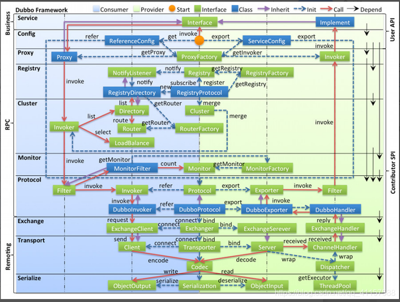
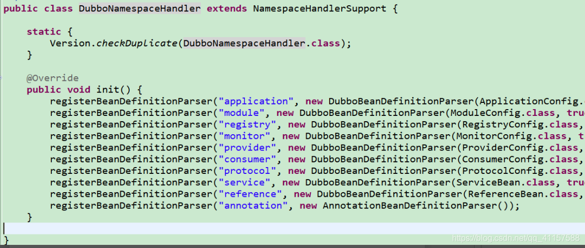

## 第七节 原理

### 7.1 RPC

一次完整的 RPC 调用流程（同步调用，异步另说）如下：

1. 服务消费方（client）调用以本地调用方式调用服务；

2. client stub 接收到调用后负责将方法、参数等组装成能够进行网络传输的消息体；

3. client stub 找到服务地址，并将消息发送到服务端；

4. server stub 收到消息后进行解码；

5. server stub 根据解码结果调用本地的服务；

6. 本地服务执行并将结果返回给 server stub；

7. server stub 将返回结果打包成消息并发送至消费方；

8. client stub 接收到消息，并进行解码；

9. 服务消费方得到最终结果。

&emsp;&emsp;dubbo 只用了两步 1 和 9，中间的过程是透明的看不到的。RPC 框架的目标就是要 2~8 这些步骤都封装起来，这些细节对用户来说是透明的，不可见的。

### 7.2 Netty 原理

**Netty 是一个异步事件驱动的网络应用程序框架**，用于快速开发可维护的高性能协议服务器和客户端。它极大地简化并简化了 TCP 和 UDP 套接字服务器等网络编程。

#### 7.2.1 BIO (Blocking IO)

#### 7.2.2 NIO (Non-Blocking IO)

* Selector 一般称为选择器 ，也可以翻译为多路复用器
* Connect（连接就绪）
* Accept（接受就绪）
* Read（读就绪）
* Write（写就绪）

#### 7.2.3 Netty 基本原理

https://www.sohu.com/a/272879207_463994

### 7.3 框架设计

* config 配置层：对外配置接口，以 ServiceConfig, ReferenceConfig 为中心，可以直接初始化配置类，也可以通过 spring 解析配置生成配置类

* proxy 服务代理层：服务接口透明代理，生成服务的客户端 Stub 和服务器端 Skeleton, 以 ServiceProxy 为中心，扩展接口为 ProxyFactory

* registry 注册中心层：封装服务地址的注册与发现，以服务 URL 为中心，扩展接口为 RegistryFactory, Registry, RegistryService

* cluster 路由层：封装多个提供者的路由及负载均衡，并桥接注册中心，以 Invoker 为中心，扩展接口为 Cluster, Directory, Router, LoadBalance

* monitor 监控层：RPC 调用次数和调用时间监控，以 Statistics 为中心，扩展接口为 MonitorFactory, Monitor, MonitorService

* protocol 远程调用层：封装 RPC 调用，以 Invocation, Result 为中心，扩展接口为 Protocol, Invoker, Exporter

* exchange 信息交换层：封装请求响应模式，同步转异步，以 Request, Response 为中心，扩展接口为 Exchanger, ExchangeChannel, ExchangeClient, ExchangeServer

* transport 网络传输层：抽象 mina 和 netty 为统一接口，以 Message 为中心，扩展接口为 Channel, Transporter, Client, Server, Codec

* serialize 数据序列化层：可复用的一些工具，扩展接口为 Serialization, ObjectInput, ObjectOutput, ThreadPool

### 7.4 标签解析

### 7.5 服务暴露流程

### 7.6 服务引用流程

 
### 7.7 服务调用流程

    
### 7.7             
    